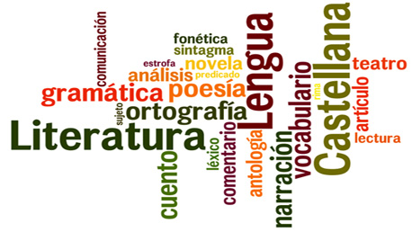

% *_Variedades del español de América_*
% Prof. ª Ruth Martín Mazón
% Curso intensivo junio/julio 2019

# Equipo docente

## Perfil

:::: {.columns}

::: {.column}

{ width=60% }\

:::

::: {.column}

- **Profesora**: Ruth Martín
- **Formación**: Filóloga hispánica, especialista en Lingüística, ELE y enseñanza en línea
- **Teléfono de contacto**: (+34) 636 616 381
- **_Email_**: ruthma@ucm.es
- **Página personal**: [LinkedIn](https://www.linkedin.com/in/ruth-mart%C3%ADn-maz%C3%B3n-93b27012a/)

:::

::::

# Descripción general del curso

## ¿Qué es para ti el español?

> El español llega a ser para nosotros como un licor que paladeamos y del cual no podemos ya prescindir. Prescindir en el ensayo, en la busca de todos sus escondrijos, de todas sus posibilidades, de todas sus puridades. Ya somos, con tanto beber de este licor, beodos del idioma. - Azorín

## ¿Qué vamos a estudiar?

**Estudio sincrónico  y diacrónico del español de América** a través de la descripción y el análisis de las **variedades dialectales** del español hispanoamericano. A esto se suma, la **geografía lingüística** de dicho territorio. 

## ¿Sabes el nombre de los paises de habla hispana?

{ width=40% }\

## ¿Has acertado?

:::: {.columns}

::: {.column}

* Argentina.
* Bolivia.
* Chile.
* Colombia.
* Costa Rica.
* Cuba.
* Ecuador.
* El Salvador.
* Guatemala.

:::

::: {.column}

* Honduras.
* México.
* Nicaragua.
* Panamá.
* Paraguay.
* Perú.
* República Dominicana.
* Uruguay.
* Venezuela.

:::

::::

## Objetivos didácticos

1. Adquirir los conocimientos fundamentales sobre la variación lingüística del español de América. 
2. Iniciación en el estudio y en el conocimiento de la bibliografía básica del español de América. 
3. Conocimiento de los recursos para el análisis y el reconocimiento de la variación lingüística en el español de América. 

## Destinatarios

Alumnos de segundo año del grado en *Español: Lengua y Literatura* de la Universidad Complutense de Madrid. 

{ width=60% }\

## Duración estimada

{ width=20% }\

Se trata de un curso intensivo de verano (**6 semanas**) con una clase presencial de 3 horas los viernes de cada una de ellas.

## Cronograma

| **Semana** | **Días**    | **Temario**      |
| :-----:    | -----:      | -----:           |
| 1          | 7 de junio  | Intro + Bloque I |
| 2          | 14 de junio | Bloque II        |
| 3          | 21 de junio | Bloque III       |
| 4          | 28 de junio | Prácticas        |
| 5          | 5 de julio  | Bloque IV        |
| 6          | 12 de julio | Examen           |

# Índice

## Bloque I: _Historia del español hispanoamericano_

Los **contenidos** temáticos son:

- Periodización.
- Base lingüística y nivel sociolingüístico.
- Andalucismo y antiandalucismo.
- El voseo. 

## Bloque II: _Fonética y Fonología_

Los **contenidos** temáticos son:

- Vocalismo.
- Consonantismo.
- Particularidades fonológico-fonéticas.

## Bloque III: _Variación morfológica, sintáctica y léxica_

Los **contenidos** temáticos son:

- Problemas generales.
- Variación morfológica, sintáctica y léxica. 

## Bloque IV: _El español de EE.UU_

Los **contenidos** temáticos son:

- Historia.
- Número de hablantes y distribución.
- Tipos de español.
- Contacto con el inglés. 
- Futuro del español en EE.UU.

# Competencias

## Requisitos previos

- Haber superado con éxito el primer año del Grado en _Español: Lengua y Literatura_.
- Estar matriculado actualmente en la _Universidad Complutense de Madrid_.

## Conocimientos propios del curso

Se dividen en dos:

Generales
 : Aquellos que se consideran de carácter global a la asignatura.    

Específicos
 : Aquellos que se adquieren a medida que se avanza en el curso. 

## Conocimientos generales

1. Dominio de la comunicación oral y escrita en español en diferentes situaciones y contextos.
2. Capacidad para:
	- Realizar un análisis crítico de textos en español.
	- Evaluar información compleja mediante el uso de la tecnología.
	- Desarrollar un trabajo interdisciplinar y en equipo o individual, para el diseño y la gestión de proyectos.

## Conocimientos específicos

1. Capacidad para reconocer, definir y caracterizar los rasgos fonéticos, morfosintácticos y léxicos del español de América.
2. Análisis, síntesis e interpretación de los rasgos propios y diferenciadores del español de América. 
3. Saber utilizar adecuadamente las fuentes bibliográficas básicas. 

# Evaluación

## Examen final

- Esta prueba se realizará de forma **presencial** y constará de dos partes:
	+ Fase teórica.
	+ Actividades.

## Prácticas

Según lo estipulado en el cronograma, la cuarta semana se dedicará complementamente a la resolución de casos prácticos, por lo que al final de la clase se deberá entregar dicho guion de prácticas vía correo electrónico. 

{ width=20% }\

# Referencias bibliográficas

## Bibliografía obligatoria

| **Título**                                | **Autor**      | **Año de publicación** |
| :-----                                    | :-----:        | -----:                 |
| *El español de América*                   | Milagros Aleza | 2002                   |
| *Manual de dialectología*                 | Manuel Alvar   | 1997                   |
| *El español en América: Fonética*         | David Canfield | 1998                   |

## Bibliografía obligatoria (Cont.)

| **Título**                                | **Autor**      | **Año de publicación** |
| :-----                                    | :-----:        | -----:                 |
| *Sintaxis hispanoamericana*               | Charles Kany   | 1976                   |
| *La aventura del español en América*      | Umberto López  | 1998                   |
| *Morfosintaxis y léxico hispanoamericano* | María Vaquero  | 1996                   |

## Bibliografía complementaria

| **Título**                                       | **Autor**      | **Año de publicación** |
| :-----                                           | :-----:        | -----:                 |
| *Estudios lingüísticos. Temas hispanoamericanos* | Amado Alonso   | 1953                   |
| *El Español de las Dos Orillas*                  | Manuel Alvar   | 1991                   |

## Recursos *web*

- Instituciones oficiales:
	- [Real Academia Española de la Lengua](http://www.rae.es/)
	- [Instituto Cervantes](https://www.cervantes.es/default.htm)
	- [Biblioteca Virtual Miguel de Cervantes](http://www.cervantesvirtual.com/)

- Pronunciación: 
	- [Fonética. Los sonidos del español][dialectologia]
	- [Corpus Oral y Sonoro del Español Rural](http://www.corpusrural.es/)

{ width=20% }\

<!-- Páginas referenciadas en más de una ocasión -->
[dialectologia]: http://dialects.its.uiowa.edu/